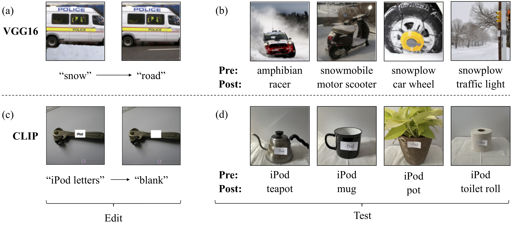

# Creating BREEDS Sub-population shift Benchmarks

This repository contains the code and data for our paper:


**Editing a classifier by rewriting its prediction rules** <br>
*Shibani Santurkar\*, Dimitris Tsipras\*, Mahi Elango\*, David Bau\*, Antonio Torralba\*, Aleksander Madry* <br>
Paper: https://arxiv.org/abs/[TODO] <br>



```bibtex
    @InProceedings{santurkar2021editing,
        title={Editing a classifier by rewriting its prediction rules},
        author={Shibani Santurkar and Dimitris Tsipras and Mahalaxmi Elango and David Bau and Antonio Torralba and Aleksander Madry},
        year={2021},
        booktitle={ArXiv preprint arXiv:TODO}
    }
```

## Getting started
*Parts of the codebase have been
derived from [original rewriting
repository](https://github.com/davidbau/rewriting) of Bau et al.
Our code also relies on the [MadryLab](http://madry-lab.ml/) public [robustness library](https://github.com/MadryLab/robustness), which will be automatically installed when you follow the instructions below. [TODO]*

1.  Clone our repo: `git clone https://github.com/MadryLab/BREEDS-Benchmarks.git`

2.  Install dependencies:
    ```
    conda create -n breeds-benchmarks python=3.7 pip
    conda activate breeds-benchmarks
    pip install -r requirements.txt
    conda install pygraphviz
    ```
3.  Download the [ImageNet](http://www.image-net.org/) dataset.

That's it! Now you can create new BREEDS datasets, or look closer at the ones
we use in our paper using this
[notebook](https://github.com/MadryLab/BREEDS-Benchmarks/blob/master/Constructing%20BREEDS%20datasets.ipynb).
You can also find a detailed walkthrough of this code in this
[documentation](https://robustness.readthedocs.io/en/latest/example_usage/breeds_datasets.html).
In order to train models using these datasets, you can use simply use [existing
code](https://robustness.readthedocs.io/en/latest/example_usage/training_lib_part_1.html) from the robustness library.


# Maintainers

* [Shibani Santurkar](https://twitter.com/ShibaniSan)
* [Dimitris Tsipras](https://twitter.com/tsiprasd)